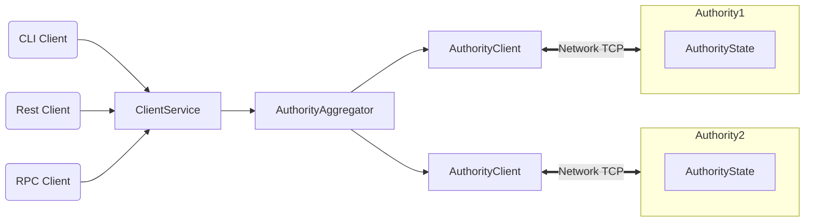

# Welcome to Iota

Iota is a next-generation smart contract platform with high throughput, low latency, and an asset-oriented programming model powered by the [Move programming language](https://github.com/iotaledger/awesome-move).

## Iota Highlights

Iota offers the following benefits and capabilities:

 * Unmatched scalability, instant settlement
 * A safe smart contract language accessible to mainstream developers
 * Ability to define rich and composable on-chain assets
 * Better user experience for web3 apps

Iota is the only blockchain today that can scale with the growth of web3 while achieving industry-leading performance, cost, programmability, and usability. As Iota approaches Mainnet launch, it will demonstrate capacity beyond the transaction processing capabilities of established systems – traditional and blockchain alike. Iota is the first internet-scale programmable blockchain platform, a foundational layer for web3.

## Iota Architecture

## Iota Overview

Iota is a smart contract platform maintained by a permissionless set of authorities that play a role similar to validators or miners in other blockchain systems.

Iota offers scalability and unprecedented low-latency for common use cases. Iota makes the vast majority of transactions processable in parallel, which makes better use of processing resources, and offers the option to increase throughput with more resources. Iota forgoes consensus to instead use simpler and lower-latency primitives for common use cases, such as payment transactions and asset transfers. This is unprecedented in the blockchain world and enables a number of new latency-sensitive distributed applications, ranging from gaming to retail payment at physical points of sale.

Iota is written in [Rust](https://www.rust-lang.org) and supports smart contracts written in the [Move programming language](https://github.com/move-language/move) to define assets that may have an owner. Move programs define operations on these assets including custom rules for their creation, the transfer of these assets to new owners, and operations that mutate assets.

Iota has a native token called IOTA, with a fixed supply. The IOTA token is used to pay for gas, and is also used as [delegated stake on authorities](https://learn.bybit.com/blockchain/delegated-proof-of-stake-dpos/) within an epoch. The voting power of authorities within this epoch is a function of this delegated stake. Authorities are periodically reconfigured according to the stake delegated to them. In any epoch, the set of authorities is [Byzantine fault tolerant](https://pmg.csail.mit.edu/papers/osdi99.pdf). At the end of the epoch, fees collected through all transactions processed are distributed to authorities according to their contribution to the operation of the system. Authorities can in turn share some of the fees as rewards to users that delegated stakes to them.

Iota is supported by several cutting-edge [peer-reviewed studies](https://github.com/iotaledger/iota/blob/main/docs/content/concepts/research-papers.mdx) and extensive years of open-source development.

## More About Iota

Use the following links to learn more about Iota and the Iota ecosystem:

 * Learn more about working with Iota in the [Iota Documentation](https://wiki.iota.org/).
 * Join the Iota community on [Iota Discord](https://discord.gg/iota).
 * Find out more about the Iota ecosystem on the [Iota Resources](https://iota.org/resources/) page.
 * Review information about Iota governance, [decentralization](https://iota.org/decentralization), and [Developer Grants Program](https://iota.org/grants-hub) on the [Iota Foundation](https://iota.org/) site.
