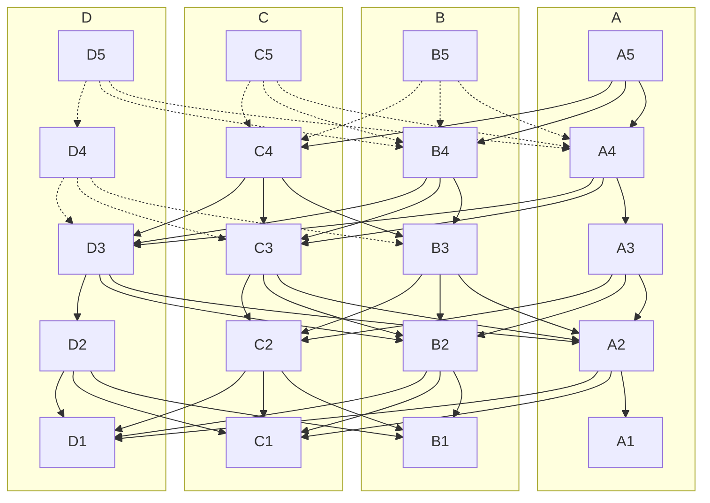

# Consensus on IOTA

## Narwall and Bullshark

IOTA uses [Narwhal](https://github.com/iotaledger/iota/tree/develop/narwhal),
and [Bullshark](https://arxiv.org/abs/2209.05633), the high-throughput mempool and consensus engines developed by Mysten
Labs, to sequence transactions that require total ordering, synchronize transactions between validators, and
periodically checkpoint the
network's state.

[Narwhal](https://arxiv.org/abs/2105.11827) ensures that data that was submitted for consensus is readily available,
while [Bullshark](https://dl.acm.org/doi/abs/10.1145/3548606.3559361) is in charge of generating a consensus on the
specific ordering of said data.

The IOTA consensus engine is a cutting-edge advancement in multi-proposer, high-throughput consensus algorithms. It can
achieve over 125,000 transactions per second with a two-second latency for a deployment of 50 participants. This
includes production-level cryptography, permanent storage, and a scaled-out primary-worker architecture.

The IOTA consensus engine offers significant scalability advantages in the following scenarios:

* A blockchain that has experimented with larger blocks and encountered increased latency before the execution phase.
* A blockchain with fast execution (e.g., focused on transactions or using a UTXO data model) where the mempool and
  consensus processes cannot keep up.

## Key Features

The Narwhal mempool offers:

* A high-throughput data availability engine with cryptographic proofs of data availability at
  a [primary node](https://github.com/iotaledger/iota/blob/develop/narwhal/primary)
* A structured graph data structure for traversing information.
* A scaled architecture that splits disk I/O and networking requirements across
  several [workers](https://github.com/iotaledger/iota/blob/develop/narwhal/worker)

## Architecture

A Narwhal instance sets up a message-passing system with a set of $3f+1$ units of stake divided among nodes. It assumes
a computationally bounded adversary that controls the network and can corrupt parties holding up to $f$ units of stake.
The validators collaborate to form a leaderless graph of transaction batches, referred to as collections in IOTA (often
called blocks in DAG-based consensus literature). This process uses mempool data with an unspecified consensus
algorithm.

The graph's _vertices_ are certified collections. Each valid collection, signed by its validator-author, must include a
round number and a certificate of availability signed by a quorum (2f+1) of validator stake. Each collection must also
contain hash pointers to a quorum of valid certificates (from validators with 2f + 1 units of stake) from the previous
round, forming the _edges_ of the graph.

Collections are formed as follows: each validator reliably broadcasts a collection for each round. Subject to specified
validity conditions, if validators with 2f + 1 stake receive a collection, they acknowledge it with a signature.
Signatures from 2f + 1 validators by stake form a certificate of availability, which is then shared and potentially
included in collections at round r + 1.

The following figure represents five rounds of constructing such a DAG (1 to 5), with validators A, B, C, and D
participating. For simplicity, each validator holds 1 unit of stake. The collections transitively acknowledged by A's
latest round in A5 are represented with solid lines in the graph.

## How It Works

* The graph construction enables the insertion of more transactions into the system by each authority and in each round.
* Certificates prove the data availability of each collection or block in every round.
* The contents form a DAG that can be identically traversed by each honest node.

## Dependencies

Narwhal is implemented using:

* [Tokio](https://github.com/tokio-rs/tokio)
* [RocksDB](https://github.com/facebook/rocksdb/)

Generic cryptography is implemented in [fastcrypto](https://github.com/MystenLabs/fastcrypto).

## Configuration

You can follow the instructions
on [Running Benchmarks](https://github.com/iotaledger/iota/blob/develop/narwhal/benchmark) to conduct a fresh deployment
of IOTA Consensus Engine.

## Further Reading

Narwhal and Tusk (Danezis et al., 2021) is a consensus system that leverages directed acyclic graphs (DAGs). DAG-based
consensus has been developed over the last 30 years, with some history summarized in Wang et al. (2020). The theoretical
ancestor of Narwhal and Tusk is DAG-Rider (Keidar et al., 2021).

Narwhal and Tusk are developed in
the [asynchronous model](https://decentralizedthoughts.github.io/2019-06-01-2019-5-31-models/). A partially synchronous
variant of Narwhal and Tusk is called Bullshark (Spiegelman et al. 2022).

Narwhal and Tusk started [as a research prototype](https://github.com/facebookresearch/narwhal) at Facebook Novi.

[Bullshark: DAG BFT Protocols Made Practical](https://arxiv.org/pdf/2201.05677.pdf) -
Bullshark replaces Tusk for even greater performance.

[Bullshark: The Partially Synchronous Version](https://arxiv.org/pdf/2209.05633.pdf) -
A simplified version of Bullshark that is used in IOTA today.

[DAG Meets BFT - The Next Generation of BFT Consensus](https://decentralizedthoughts.github.io/2022-06-28-DAG-meets-BFT/) -
Explains the evolution of the consensus protocol used by IOTA.

## Bibliography

* Danezis, G., Kogias, E. K., Sonnino, A., & Spiegelman, A. (2021). Narwhal and Tusk: A DAG-based Mempool and Efficient
  BFT Consensus. ArXiv:2105.11827 [Cs]. http://arxiv.org/abs/2105.11827
* Spiegelman, A., Giridharan, N., Sonnino, A., & Kokoris-Kogias, L. (2022). Bullshark: DAG BFT Protocols Made Practical.
  ArXiv:2201.05677 [Cs]. https://dl.acm.org/doi/abs/10.1145/3548606.3559361
* Spiegelman, A., Giridharan, N., Sonnino, A., & Kokoris-Kogias, L. (2022). Bullshark: The Partially Synchronous
  Version. ArXiv:2209.05633 [Cs]. https://arxiv.org/abs/2209.05633
* Keidar, I., Kokoris-Kogias, E., Naor, O., & Spiegelman, A. (2021). All You Need is DAG. ArXiv:
  2102.08325 [Cs]. http://arxiv.org/abs/2102.08325
* Wang, Q., Yu, J., Chen, S., & Xiang, Y. (2020). SoK: Diving into DAG-based Blockchain Systems. ArXiv:
  2012.06128 [Cs]. http://arxiv.org/abs/2012.06128
