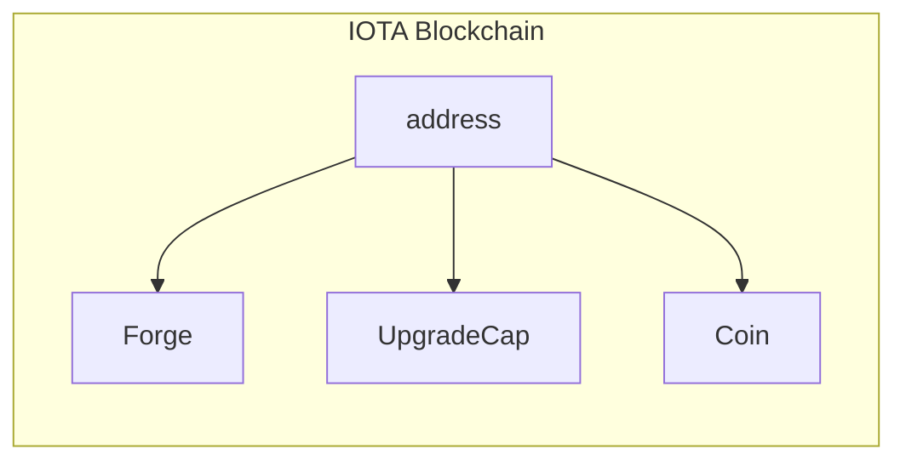
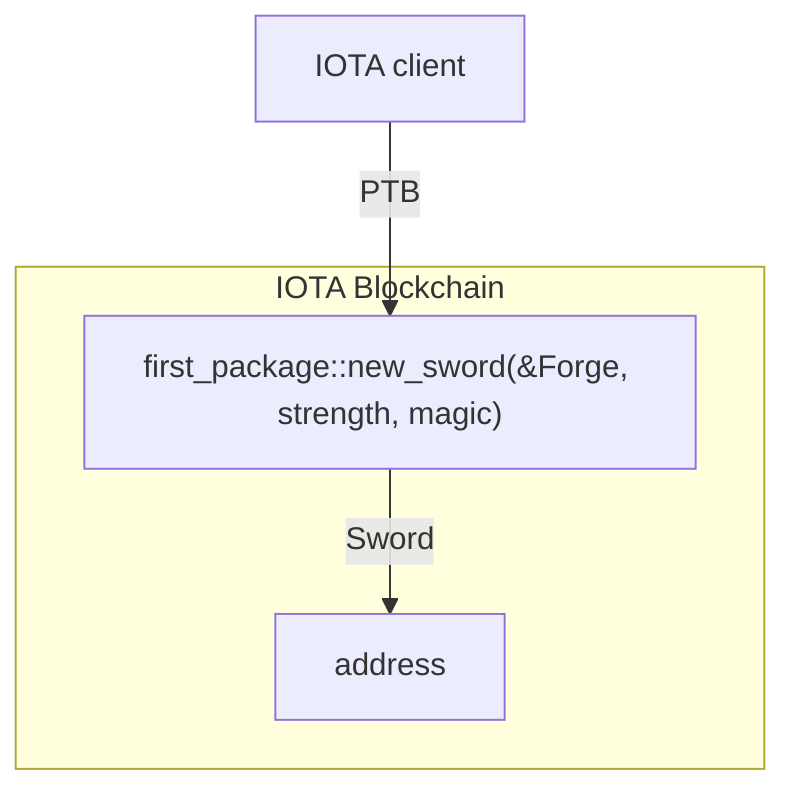

import AddressPrefix from "../../_snippets/address-prefix.mdx";
import Quiz from '@site/src/components/Quiz';
import questions from '/json/developer/getting-started/publish.json';

# Publish a Package

After you have successfully [created](create-a-package.mdx) and [tested](build-test.mdx) your package, the next step is to publish it so you can start using its functions on the IOTA network. When you publish a package, it becomes a permanent and immutable public object on the IOTA network.

## Publishing Your Package

To publish your package, use the IOTA client's `publish` command. Execute this command from your package's root directory, and include the `--gas-budget` parameter to set the maximum gas you're willing to spend on this transaction. If the transaction requires more gas than your budget, it will fail.

```shell
iota client publish
```

Once the transaction succeeds, you will receive a response similar to the following, detailing the transaction data, effects, and any changes to objects and balances:

```
╭─────────────────────────────────────────────────────────────────────╮
│ Object Changes                                                      │
├─────────────────────────────────────────────────────────────────────┤
│ Created Objects:                                                    │
│  ...                                                                │
|                                                                     |
│ Mutated Objects:                                                    │
│  ...                                                                │
|                                                                     |
│ Published Objects:                                                  │
│  ┌──                                                                │
│  │ PackageID: <PACKAGE-ID>                                          │
│  │ Version: 1                                                       │
│  │ Digest: <DIGEST-HASH>                                            │
│  │ Modules: first_package                                               │
│  └──                                                                │
╰─────────────────────────────────────────────────────────────────────╯
```

The **Object Changes** section includes information about the package you just published, under **Published Objects**. Your actual `PackageID` will appear as an address, like `0x123...ABC`.

### Understanding Your Address's Object List

If this is your first time publishing a package, your active address should now hold three objects:

1. **Coin**: A `Coin` object that you obtained from the [Testnet faucet](get-coins.mdx).
2. **Forge**: The `Forge` created when you published this package. The `init` function was executed during the publishing process, creating the `Forge` and assigning it to you (the sender).
3. **UpgradeCap**: An `UpgradeCap` associated with the package. This object is used if you need to [upgrade your package](../iota-101/move-overview/package-upgrades/upgrade.mdx) or destroy it to make the package immutable.



You can retrieve the complete list of objects associated with your address using the `iota client objects` command:

```shell
iota client objects

╭───────────────────────────────────────────────────────────────────────────────────────╮
│ ╭────────────┬──────────────────────────────────────────────────────────────────────╮ │
│ │ objectId   │  <OBJECT-ID>                                                         │ │
│ │ version    │  3                                                                   │ │
│ │ digest     │  <DIGEST-HASH>                                                       │ │
│ │ objectType │  <PACKAGE-ID>::first_package::Forge                                      │ │
│ ╰────────────┴──────────────────────────────────────────────────────────────────────╯ │
│ ╭────────────┬──────────────────────────────────────────────────────────────────────╮ │
│ │ objectId   │  <OBJECT-ID>                                                         │ │
│ │ version    │  3                                                                   │ │
│ │ digest     │  <DIGEST-HASH>                                                       │ │
│ │ objectType │  0x0000..0002::coin::Coin                                            │ │
│ ╰────────────┴──────────────────────────────────────────────────────────────────────╯ │
│ ╭────────────┬──────────────────────────────────────────────────────────────────────╮ │
│ │ objectId   │  <OBJECT-ID>                                                         │ │
│ │ version    │  3                                                                   │ │
│ │ digest     │  <DIGEST-HASH>                                                       │ │
│ │ objectType │  0x0000..0002::package::UpgradeCap                                   │ │
│ ╰────────────┴──────────────────────────────────────────────────────────────────────╯ │
╰───────────────────────────────────────────────────────────────────────────────────────╯
```

### Accessing Your Package

After successfully publishing the package, you can use the `iota client call` command to execute individual functions or create sophisticated [programmable transaction blocks](../iota-101/transactions/ptb/prog-txn-blocks.mdx) that group multiple commands into a single, cost-effective transaction with the `iota client ptb` command.



#### Programmable Transaction Example

The following example demonstrates how to call the `new_sword` function from your package to create a new `Sword` and then transfer it to a specified address.

```shell
$ iota client ptb \
	--assign forge @<FORGE-ID> \
	--assign to_address @<TO-ADDRESS> \
	--move-call <PACKAGE-ID>::first_package::new_sword forge 3 3 \
	--assign sword \
	--transfer-objects "[sword]" to_address \
	--gas-budget 100000000
```

:::info

<AddressPrefix />

:::

Note how the command uses `--assign` to define variables for `<FORGE-ID>`, `<TO-ADDRESS>`, and `<PACKAGE-ID>`. This approach helps maintain clarity in your PTBs. Ensure you replace `<FORGE-ID>`, `<TO-ADDRESS>`, and `<PACKAGE-ID>` with the actual `objectId` of the `Forge` object, the recipient's address (your address, for instance), and the `packageID`, respectively.

After executing the transaction, verify the status of the `Sword` object using the `iota client objects` command again. If you set your address as the `<TO-ADDRESS>`, you should now see a total of four objects:

```
╭───────────────────────────────────────────────────────────────────────────────────────╮
│ ╭────────────┬──────────────────────────────────────────────────────────────────────╮ │
│ │ objectId   │  <OBJECT-ID>                                                         │ │
│ │ version    │  4                                                                   │ │
│ │ digest     │  <DIGEST-HASH>                                                       │ │
│ │ objectType │  <PACKAGE-ID>::first_package::Forge                                      │ │
│ ╰────────────┴──────────────────────────────────────────────────────────────────────╯ │
│ ╭────────────┬──────────────────────────────────────────────────────────────────────╮ │
│ │ objectId   │  <OBJECT-ID>                                                         │ │
│ │ version    │  4                                                                   │ │
│ │ digest     │  <DIGEST-HASH>                                                       │ │
│ │ objectType │  0x0000..0002::coin::Coin                                            │ │
│ ╰────────────┴──────────────────────────────────────────────────────────────────────╯ │
│ ╭────────────┬──────────────────────────────────────────────────────────────────────╮ │
│ │ objectId   │  <OBJECT-ID>                                                         │ │
│ │ version    │  4                                                                   │ │
│ │ digest     │  <DIGEST-HASH>                                                       │ │
│ │ objectType │  <PACKAGE-ID>::first_package::Sword                                      │ │
│ ╰────────────┴──────────────────────────────────────────────────────────────────────╯ │
│ ╭────────────┬──────────────────────────────────────────────────────────────────────╮ │
│ │ objectId   │  <OBJECT-ID>                                                         │ │
│ │ version    │  3                                                                   │ │
│ │ digest     │  <DIGEST-HASH>                                                       │ │
│ │ objectType │  0x0000..0002::package::UpgradeCap                                   │ │
│ ╰────────────┴──────────────────────────────────────────────────────────────────────╯ │
╰───────────────────────────────────────────────────────────────────────────────────────╯
```

Congratulations! You have successfully published a package to the IOTA network and modified the blockchain state using a programmable transaction block.


<Quiz questions={questions} />