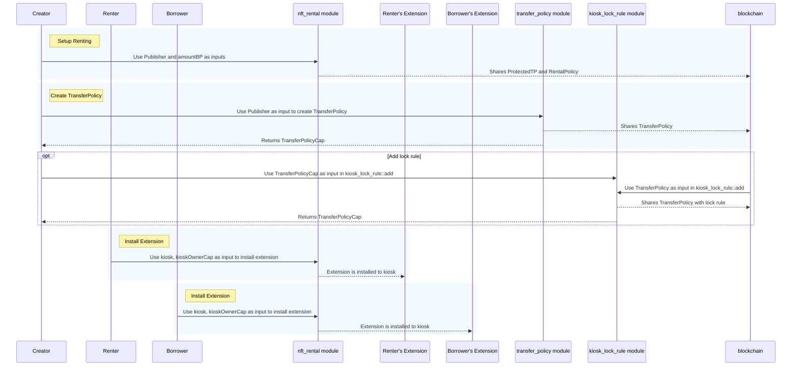
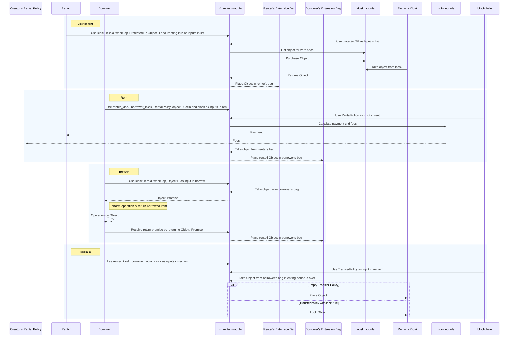
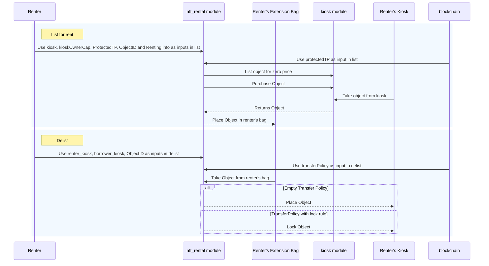

# Rent NFTs with Kiosk Apps in IOTA

NFT renting allows users to temporarily access and use NFTs without owning them outright. 
This guide will explore how to implement NFT rental functionality using the [Kiosk Apps standard](../../standards/kiosk-apps.mdx) on the IOTA blockchain.
This approach is compatible with the [Ethereum ERC-4907](https://eips.ethereum.org/EIPS/eip-4907) renting standard,
making it ideal for developers with Solidity experience who are transitioning to IOTA.

## Overview of NFT Renting

By leveraging the [Kiosk Apps standard](../../standards/kiosk-apps.mdx), you can create a rental infrastructure that allows users to rent NFTs according to predefined policies.
This system enables:

- Lenders to list their NFTs for rent for specific durations.
- Lenders to set rental periods that borrowers must adhere to.
- Borrowers to gain mutable or immutable access to NFTs.
- Respect for creator-defined royalties through custom transfer policy rules.
- The ability to sell items normally after the rental period ends.

## Key Features

The NFT rental system satisfies several critical requirements:

- **Flexible Rental Periods**: Lenders can specify how long their NFTs are available for rent.
- **Access Control**: Borrowers can have read-only (immutable) or full (mutable) access, with lenders adjusting fees accordingly.
- **Post-Rental Actions**: Once the rental period concludes, NFTs can be sold or re-listed for rent.
- **Royalty Compliance**: Creator royalties are enforced through  [transfer policy rules](../objects/transfers/custom-rules.mdx), ensuring creators are compensated appropriately.

## Practical Applications

NFT renting has numerous real-world applications across various industries:

### Gaming

In gaming, NFT renting enhances user experience by:

- Allowing players to rent unique in-game items, characters, skins, or accessories.
- Ensuring ownership authenticity to combat fraud and counterfeiting.
- Enabling cross-game integration, where rented assets can be used in multiple games.
- Supporting a digital asset ecosystem where collectibles can be rented securely.

### Ticketing

NFTs revolutionize ticketing by:

- Providing a secure and traceable way to transfer, resell, or rent tickets.
- Reducing the risk of counterfeit tickets in the secondary market.
- Ensuring transparency and authenticity through blockchain technology.

### Virtual Real Estate

In the metaverse, renting virtual land and offices offers:

- Flexible solutions for businesses to host events without permanent commitments.
- Cost-effective virtual office spaces for remote work.
- Alignment with the evolving dynamics of digital operations.

### Temporary Assets and Subscriptions

Renting NFTs for temporary assets and subscriptions allows:

- Access to high-end virtual experiences, such as exclusive events or digital fashion.
- Subscription models where users pay monthly for a set number of assets.
- Holders to rent out unused subscriptions, benefiting both the holder and the protocol.

## Implementing the Rental System

Before implementing the rental system, consider the following:

- **Kiosk Transfers**: Transferring kiosks during an active rental can lead to unexpected behavior. To prevent this, you might use personal kiosks to disallow kiosk transfers.
- **Charging Periods**: This example charges rental fees based on days. You can adjust the logic to charge per hour or even per second, depending on your needs.

The rental smart contract utilizes th [Kiosk Apps](../../standards/kiosk-apps.mdx) standard.
Both lenders and borrowers must install a Kiosk extension to participate.
Additionally, the creator of the NFT type must create a rental policy and a `ProtectedTP` object to allow the extension to manage rentals while enforcing royalties.

## Move Module Details TODO UPDATE LINK
 
The NFT rental functionality is implemented in a single Move module: `nft_rental.move`.
You can find the source code in the [IOTA repository](https://github.com/iotaledger/iota/tree/main/examples/move/nft-rental/sources/nft_rental.move) under the `examples` directory. The code includes comments to help you understand the logic and structure.

### The `nft_rental` Module

The `nft_rental` module provides an API for:

- Listing NFTs for rent.
- De-listing NFTs from rent.
- Renting NFTs.
- Borrowing by reference or by value.
- Reclaiming NFTs for the lender.

### Data Structures

The module defines several key structs that form the backbone of the rental system:

#### `Rentables`

Acts as the extension key for the kiosk `Rentables` extension.

```move
public struct Rentables has drop {}
```

#### `Rented`

Represents a rented item and is used as a dynamic field key in the borrower's [`Bag`](../move-overview/collections.mdx#bag).
The struct has `store`, `copy`, and `drop` abilities because they are necessary for all dynamic field keys.

```move
public struct Rented has store, copy, drop { id: ID }
```

#### `Listed`

Represents an item listed for rent and is used as a dynamic field key in the lender's [`Bag`](../move-overview/collections.mdx#bag).
The struct has `store`, `copy`, and `drop` abilities because they are necessary for all dynamic field keys.

```move
public struct Listed has store, copy, drop { id: ID }
```

#### `Promise`

Created when borrowing by value, this struct ensures the item can only be returned through the `return_val` function. 
The `Promise` field lacks the `store` ability as it shouldn't be wrapped inside other objects.
It also lacks the `drop` ability because only the `return_val` function can consume it.

```move
public struct Promise {
  item: Rented,
  duration: u64,
  start_date: u64,
  price_per_day: u64,
  renter_kiosk: address,
  borrower_kiosk: ID
}
```

#### `Rentable<T>`

A wrapper that holds an asset being rented, including rental period, cost, and lender information.

This struct requires the `store` ability because it stores a value `T` that definitely also has `store`.

```move
public struct Rentable<T: key + store> has store {
  object: T,
  /// Total amount of time offered for renting in days.
  duration: u64,
  /// Initially undefined, is updated once someone rents it.
  start_date: Option<u64>,
  price_per_day: u64,
  /// The kiosk id that the object was taken from.
  kiosk_id: ID,
}
```

#### `RentalPolicy<T>`

A shared object that defines the royalties the creator receives from each rental transaction.

```move
public struct RentalPolicy<phantom T> has key, store {
  id: UID,
  balance: Balance<IOTA>,
  /// Note: Move does not support float numbers.
  ///
  /// If you need to represent a float, you need to determine the desired
  /// precision and use a larger integer representation.
  ///
  /// For example, percentages can be represented using basis points:
  /// 10000 basis points represent 100% and 100 basis points represent 1%.
  amount_bp: u64
}
```

#### `ProtectedTP<T>`

A shared object that provides authorized access to an empty `TransferPolicy`,
allowing the rental module to operate within the extension framework while ensuring assets remain tradable.

A protected empty transfer policy is required to facilitate the rental process so that the extension can transfer the asset without any additional rules to resolve (like lock rule, loyalty rule, and so on). If creators want to enforce royalties on rentals, they can use the `RentalPolicy` detailed previously.

```move
public struct ProtectedTP<phantom T> has key, store {
  id: UID,
  transfer_policy: TransferPolicy<T>,
  policy_cap: TransferPolicyCap<T>
}
```

## Function Definitions

The following functions define the logic of the NFT rental system:

### `install`

Allows users to install the `Rentables` extension in their kiosk.

```move
public fun install(
  kiosk: &mut Kiosk,
  cap: &KioskOwnerCap,
  ctx: &mut TxContext
){
  kiosk_extension::add(Rentables {}, kiosk, cap, PERMISSIONS, ctx);
}
```

### `remove`

Enables the kiosk owner to remove the `Rentables` extension when it's no longer needed.  The `kiosk_extension::remove` function performs the ownership check before executing.

```move
public fun remove(kiosk: &mut Kiosk, cap: &KioskOwnerCap, _ctx: &mut TxContext){
  kiosk_extension::remove<Rentables>(kiosk, cap);
}
```

### `setup_renting`

Mints and shares a `ProtectedTP` and a `RentalPolicy` object for a specific NFT type. Only the publisher of the NFT type can perform this action.

```move
public fun setup_renting<T>(publisher: &Publisher, amount_bp: u64, ctx: &mut TxContext) {
  // Creates an empty TP and shares a ProtectedTP<T> object.
  // This can be used to bypass the lock rule under specific conditions.
  // Storing inside the cap the ProtectedTP with no way to access it
  // as we do not want to modify this policy
  let (transfer_policy, policy_cap) = transfer_policy::new<T>(publisher, ctx);

  let protected_tp = ProtectedTP {
    id: object::new(ctx),
    transfer_policy,
    policy_cap,
  };

  let rental_policy = RentalPolicy<T> {
    id: object::new(ctx),
    balance: balance::zero<IOTA>(),
    amount_bp,
  };

  transfer::share_object(protected_tp);
  transfer::share_object(rental_policy);
}
```

### `list`

Allows lenders to list their NFTs for rent in the `Rentables` extension's bag.

```move
public fun list<T: key + store>(
  kiosk: &mut Kiosk,
  cap: &KioskOwnerCap,
  protected_tp: &ProtectedTP<T>,
  item_id: ID,
  duration: u64,
  price_per_day: u64,
  ctx: &mut TxContext,
) {
    
  // Aborts if Rentables extension is not installed.
  assert!(kiosk_extension::is_installed<Rentables>(kiosk), EExtensionNotInstalled);

  // Sets the kiosk owner to the transaction sender to keep metadata fields up to date.
  // This is also crucial to ensure the correct person receives the payment.
  // Prevents unexpected results in cases where the kiosk could have been transferred 
  // between users without the owner being updated.
  kiosk.set_owner(cap, ctx);

  // Lists the item for zero IOTA.
  kiosk.list<T>(cap, item_id, 0);

  // Constructs a zero coin.
  let coin = coin::zero<IOTA>(ctx);
  // Purchases the item with 0 IOTA.
  let (object, request) = kiosk.purchase<T>(item_id, coin);

  // Resolves the TransferRequest with the empty TransferPolicy which is protected and accessible only via this module.
  let (_item, _paid, _from) = protected_tp.transfer_policy.confirm_request(request);

  // Wraps the item in the Rentable struct along with relevant metadata.
  let rentable = Rentable {
    object,
    duration,
    start_date: option::none<u64>(),
    price_per_day,
    kiosk_id: object::id(kiosk),
  };

  // Places the rentable as listed in the extension's bag (place_in_bag is a helper method defined in nft_rental.move file).
  place_in_bag<T, Listed>(kiosk, Listed { id: item_id }, rentable);
}
```

### `delist`

Allows lenders to remove their NFTs from the rental listings, provided they are not currently rented. The function also places (or locks, if a lock rule is present) the object back to owner's kiosk. You should mint an empty `TransferPolicy` even if you don't want to apply any royalties. If at some point you do want to enforce royalties, you can always update the existing `TransferPolicy`.

```move
public fun delist<T: key + store>(
  kiosk: &mut Kiosk,
  cap: &KioskOwnerCap,
  transfer_policy: &TransferPolicy<T>,
  item_id: ID,
  _ctx: &mut TxContext,
) {

  // Aborts if the cap doesn't match the Kiosk.
  assert!(kiosk.has_access(cap), ENotOwner);

  // Removes the rentable item from the extension's Bag (take_from_bag is a helper method defined in nft_rental.move file). 
  let rentable = take_from_bag<T, Listed>(kiosk, Listed { id: item_id });

  // Deconstructs the Rentable object.
  let Rentable {
    object,
    duration: _,
    start_date: _,
    price_per_day: _,
    kiosk_id: _,
  } = rentable;

  // Respects the lock rule, if present, by re-locking the asset in the owner's Kiosk.
  if (has_rule<T, LockRule>(transfer_policy)) {
    kiosk.lock(cap, transfer_policy, object);
  } else {
    kiosk.place(cap, object);
  };
}
```

### `rent`

Enables borrowers to rent an NFT, transferring the rental fee and updating the rental policy balance. The `rental_policy` defines the portion of the coin that is retained as fees and added to the rental policy's balance.

```move
public fun rent<T: key + store>(
  renter_kiosk: &mut Kiosk,
  borrower_kiosk: &mut Kiosk,
  rental_policy: &mut RentalPolicy<T>,
  item_id: ID,
  mut coin: Coin<IOTA>,
  clock: &Clock,
  ctx: &mut TxContext,
) {

  // Aborts if Rentables extension is not installed.
  assert!(kiosk_extension::is_installed<Rentables>(borrower_kiosk), EExtensionNotInstalled);

  let mut rentable = take_from_bag<T, Listed>(renter_kiosk, Listed { id: item_id });

  // Calculates the price of the rental based on the days it was rented for by ensuring the outcome can be stored as a u64.
  let max_price_per_day = MAX_VALUE_U64 / rentable.duration;
  assert!(rentable.price_per_day <= max_price_per_day, ETotalPriceOverflow);
  let total_price = rentable.price_per_day * rentable.duration;

  // Accepts only exact balance for the payment and does not give change.
  let coin_value = coin.value();
  assert!(coin_value == total_price, ENotEnoughCoins);

  // Calculate fees_amount using the given basis points amount (percentage), ensuring the
  // result fits into a 64-bit unsigned integer.
  let mut fees_amount = coin_value as u128;
  fees_amount = fees_amount * (rental_policy.amount_bp as u128);
  fees_amount = fees_amount / (MAX_BASIS_POINTS as u128);

  // Calculate fees_amount using the given basis points amount (percentage), ensuring the result fits into a 64-bit unsigned integer.
  let fees = coin.split(fees_amount as u64, ctx);

  // Merges the fee balance of the given coin with the RentalPolicy balance.
  coin::put(&mut rental_policy.balance, fees);
  // Transfers the payment to the renter.
  transfer::public_transfer(coin, renter_kiosk.owner());
  rentable.start_date.fill(clock.timestamp_ms());

  place_in_bag<T, Rented>(borrower_kiosk, Rented { id: item_id }, rentable);
}
```

### `borrow`

Allows borrowers to access the rented NFT by reference.

```move
public fun borrow<T: key + store>(
  kiosk: &mut Kiosk,
  cap: &KioskOwnerCap,
  item_id: ID,
  _ctx: &mut TxContext,
): &T {
  // Aborts if the cap doesn't match the Kiosk.
  assert!(kiosk.has_access(cap), ENotOwner);
  let ext_storage_mut = kiosk_extension::storage_mut(Rentables {}, kiosk);
  let rentable: &Rentable<T> = &ext_storage_mut[Rented { id: item_id }];
  &rentable.object
}
```

### `borrow_val`

Enables borrowers to temporarily acquire the rented NFT by value, creating a `Promise` to return it.
The `Promise` stores all the information about the `Rentable`, facilitating the reconstruction of the `Rentable` upon object return.

```move
public fun borrow_val<T: key + store>(
  kiosk: &mut Kiosk,
  cap: &KioskOwnerCap,
  item_id: ID,
  _ctx: &mut TxContext,
): (T, Promise) {
  // Aborts if the cap doesn't match the Kiosk.
  assert!(kiosk.has_access(cap), ENotOwner);
  let borrower_kiosk = object::id(kiosk);

  let rentable = take_from_bag<T, Rented>(kiosk, Rented { id: item_id });

  // Construct a Promise struct containing the Rentable's metadata.
  let promise = Promise {
    item: Rented { id: item_id },
    duration: rentable.duration,
    start_date: *option::borrow(&rentable.start_date),
    price_per_day: rentable.price_per_day,
    renter_kiosk: rentable.kiosk_id,
    borrower_kiosk
  };

  // Deconstructs the rentable and returns the promise along with the wrapped item T.
  let Rentable {
    object,
    duration: _,
    start_date: _,
    price_per_day: _,
    kiosk_id: _,
  } = rentable;

  (object, promise)
}
```

### `return_val`

Allows borrowers to return the borrowed NFT using the `Promise`.

```move
public fun return_val<T: key + store>(
  kiosk: &mut Kiosk,
  object: T,
  promise: Promise,
  _ctx: &mut TxContext,
) {
  assert!(kiosk_extension::is_installed<Rentables>(kiosk), EExtensionNotInstalled);

  let Promise {
    item,
    duration,
    start_date,
    price_per_day,
    renter_kiosk,
    borrower_kiosk,
  } = promise;

  let kiosk_id = object::id(kiosk);
  assert!(kiosk_id == borrower_kiosk, EInvalidKiosk);

  let rentable = Rentable {
    object,
    duration,
    start_date: option::some(start_date),
    price_per_day,
    kiosk_id: renter_kiosk,
  };

  place_in_bag(kiosk, item, rentable);
}
```

:::note

The `reclaim` function is manually invoked, and it's the rental service provider's responsibility to remind the lender to reclaim their asset.
To prevent borrowers from holding assets longer than the rental period, you can modify the `borrow` and `borrow_val` functions to check if the rental period has expired.

:::

### `reclaim`

Allows lenders to reclaim their NFT after the rental period has expired.

```move
public fun reclaim<T: key + store>(
  renter_kiosk: &mut Kiosk,
  borrower_kiosk: &mut Kiosk,
  transfer_policy: &TransferPolicy<T>,
  clock: &Clock,
  item_id: ID,
  _ctx: &mut TxContext,
) {

  // Aborts if Rentables extension is not installed.
  assert!(kiosk_extension::is_installed<Rentables>(renter_kiosk), EExtensionNotInstalled);

  let rentable = take_from_bag<T, Rented>(borrower_kiosk, Rented { id: item_id });

  // Destructures the Rentable struct to place it back to the renter's Kiosk.
  let Rentable {
    object,
    duration,
    start_date,
    price_per_day: _,
    kiosk_id,
  } = rentable;

  // Aborts if provided kiosk is different that the initial kiosk the item was borrowed from.
  assert!(object::id(renter_kiosk) == kiosk_id, EInvalidKiosk);

  let start_date_ms = *option::borrow(&start_date);
  let current_timestamp = clock.timestamp_ms();
  let final_timestamp = start_date_ms + duration * SECONDS_IN_A_DAY;

  // Aborts if rental duration has not elapsed.
  assert!(current_timestamp > final_timestamp, ERentingPeriodNotOver);

  // Respects the lock rule, if present, by re-locking the asset in the owner's kiosk.
  if (transfer_policy.has_rule<T, LockRule>()) {
    kiosk_extension::lock<Rentables, T>(
      Rentables {},
      renter_kiosk,
      object,
      transfer_policy,
    );
  } else {
    kiosk_extension::place<Rentables, T>(
      Rentables {},
      renter_kiosk,
      object,
      transfer_policy,
    );
  };
}
```

## Workflow Overview

:::note

This implementation assumes that each creator mints a `TransferPolicy`,
even if it's empty, to allow the `Rentables` extension to function properly.
This is in addition to invoking the `setup_renting` method.

:::

### Initialization

The initialization process occurs once for each entity:

- **For New NFT Types**: Creators must invoke `setup_renting` and create a `TransferPolicy`.
- **For Borrowers**: If they don't have a kiosk, one should be created. They must install the `Rentables` extension.
- **For Lenders**: Similar to borrowers, they need a kiosk and must install the `Rentables` extension.




### List-Rent-Borrow-Reclaim



### List-Delist

