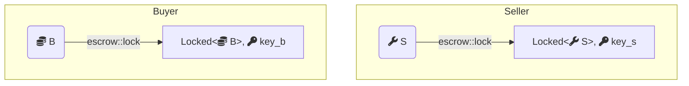
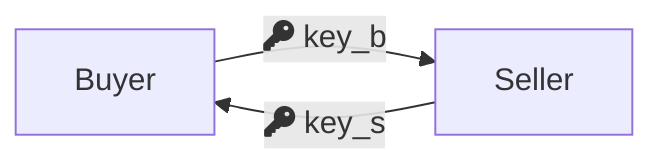
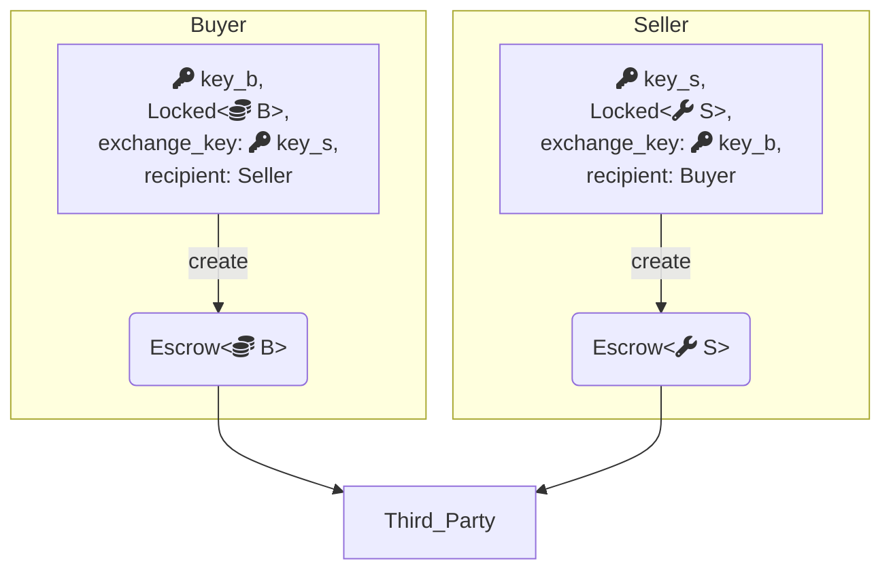
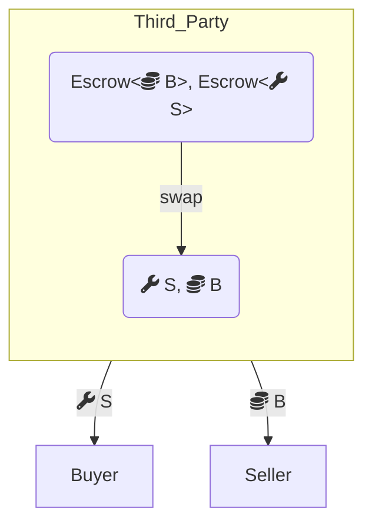
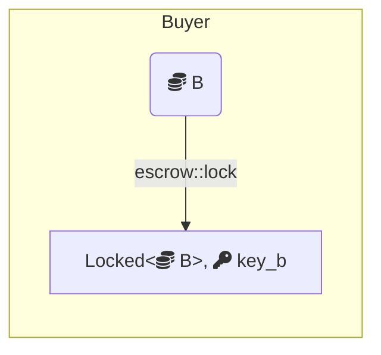
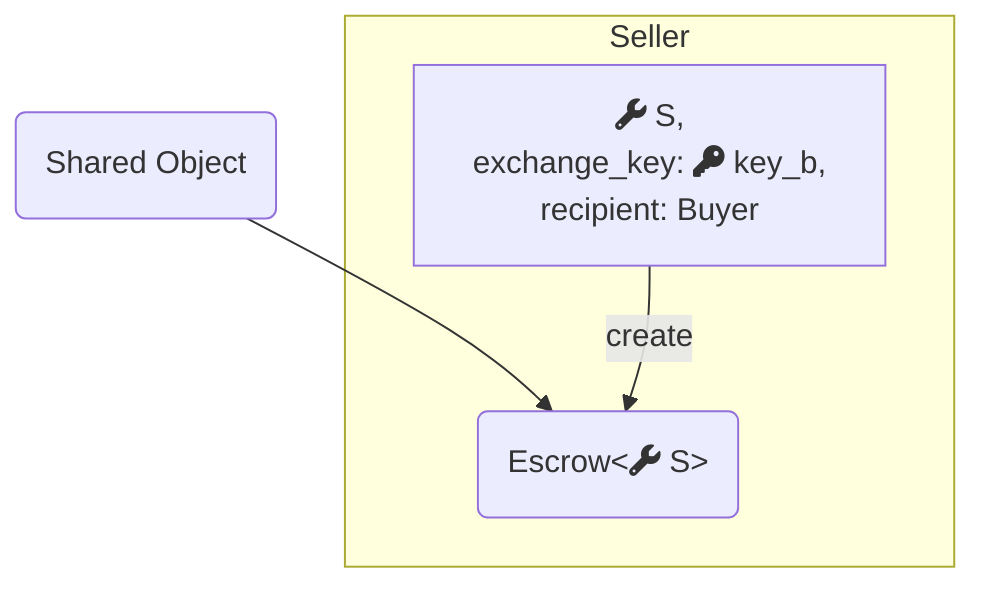
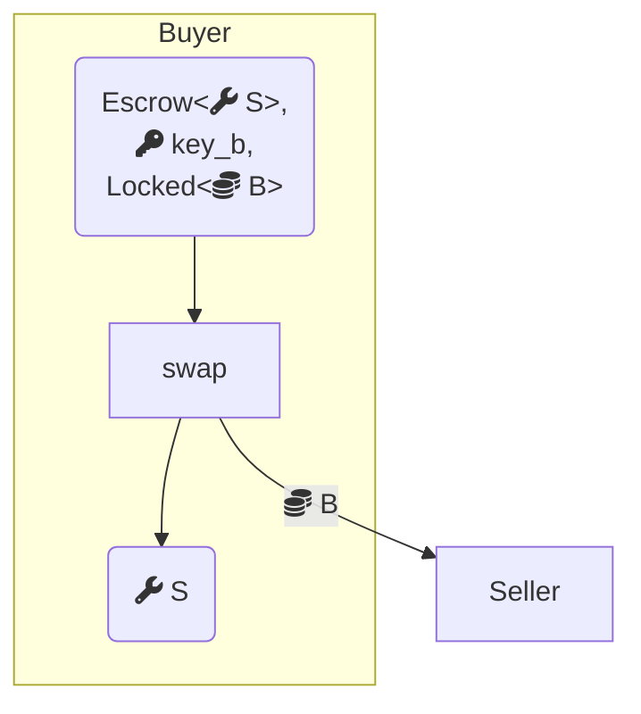

# Shared versus Owned Objects

On IOTA, objects can be:
* **Shared**: Accessible for reads and writes by any transaction
* **owned**: Accessible for reads and writes by transactions signed by their owner.

Both shared and owned objects offer unique advantages and trade-offs
that you should carefully consider when designing your application.

## Trade-Offs Between Shared and Owned Objects

### Owned Objects

Transactions involving only owned objects benefit from very low latency to finality because they bypass consensus.
However, only the owner can access these objects,
which complicates processes requiring interaction between multiple parties. 
Access to frequently used (hot) objects must be coordinated off-chain.

### Shared Objects

Transactions that involve shared objects require consensus to manage reads and writes, 
leading to slightly higher [gas](../../../about-iota/tokenomics/gas-in-iota.mdx) costs and increased latency.
When multiple shared objects or particularly popular objects are accessed,
contention may further increase latency.
However, shared objects offer flexibility,

:::info

For more information on object types in IOTA, see [Object Ownership](object-ownership/object-ownership.mdx).

:::

## Example: Escrow

The [following example](https://github.com/iotaledger/iota/blob/93e6b4845a481300ed4a56ab4ac61c5ccb6aa008/examples/move/escrow/sources/lock.move) demonstrates the trade-offs between shared and owned objects
by implementing an escrow service in both styles.
The service allows two parties to perform a trustless swap of objects,
with a third party holding the objects in escrow.

### `Locked<T>` and `Key`

Both implementations use a primitive for locking values, which offers the following interface:

```move
module escrow::lock {
    public fun lock<T: store>(obj: T, ctx: &mut TxContext): (Locked<T>, Key);
    public fun unlock<T: store>(locked: Locked<T>, key: Key): T
}
```

Any `T: store` can be locked to get a `Locked<T>` and a corresponding `Key`.
The locked value and its key can then be consumed to retrieve the wrapped object.
This interface ensures that locked values cannot be modified without first being unlocked,
making tampering detectable by tracking the key’s ID.

### Owned Objects

The protocol for swapping via [escrow with owned objects](https://github.com/iotaledger/iota/blob/93e6b4845a481300ed4a56ab4ac61c5ccb6aa008/examples/move/escrow/sources/owned.move) begins
with both parties locking their respective objects.



This locking mechanism ensures that objects cannot be altered once the swap is agreed upon
. If either party decides not to proceed, they can simply unlock their object.

If both parties agree to continue, they exchange the keys:



A third party acts as a custodian, holding the objects until both have arrived, then completing the swap:

```move
public fun create<T: key + store>(
    key: Key,
    locked: Locked<T>,
    exchange_key: ID,
    recipient: address,
    custodian: address,
    ctx: &mut TxContext,
) {
    let escrow = Escrow {
        id: object::new(ctx),
        sender: tx_context::sender(ctx),
        recipient,
        exchange_key,
        escrowed_key: object::id(&key),
        escrowed: lock::unlock(locked, key),
    };

    transfer::transfer(escrow, custodian);
}
```



The `create` function prepares the `Escrow` request and sends it to the custodian.
The object being offered is passed in locked, along with its key and the ID of the object being requested.
The custodian is trusted to complete the swap if it holds both sides or to return the objects if requested.




```move
public fun swap<T: key + store, U: key + store>(
    obj1: Escrow<T>,
    obj2: Escrow<U>,
) {
    let Escrow {
        id: id1,
        sender: sender1,
        recipient: recipient1,
        exchange_key: exchange_key1,
        escrowed_key: escrowed_key1,
        escrowed: escrowed1,
    } = obj1;

    let Escrow {
        id: id2,
        sender: sender2,
        recipient: recipient2,
        exchange_key: exchange_key2,
        escrowed_key: escrowed_key2,
        escrowed: escrowed2,
    } = obj2;

    object::delete(id1);
    object::delete(id2);

    // Ensure sender and recipient match each other
    assert!(sender1 == recipient2, EMismatchedSenderRecipient);
    assert!(sender2 == recipient1, EMismatchedSenderRecipient);

    // Ensure the objects match and haven't been modified
    assert!(escrowed_key1 == exchange_key2, EMismatchedExchangeObject);
    assert!(escrowed_key2 == exchange_key1, EMismatchedExchangeObject);

    // Perform the swap
    transfer::public_transfer(escrowed1, recipient1);
    transfer::public_transfer(escrowed2, recipient2);
}
```

The `swap` function verifies that the senders and recipients match and that each party wants the object being offered by the other.
The custodian’s role is limited to matching the objects correctly or returning them, ensuring the correctness of the swap.

### Shared Objects

In the [shared object example](https://github.com/iotaledger/iota/blob/93e6b4845a481300ed4a56ab4ac61c5ccb6aa008/examples/move/escrow/sources/shared.move),
the protocol starts with the first party locking the object they want to swap:



The second party can view the locked object, and if they wish to swap, they create a swap request:



```move
public fun create<T: key + store>(
    escrowed: T,
    exchange_key: ID,
    recipient: address,
    ctx: &mut TxContext
) {
    let escrow = Escrow {
        id: object::new(ctx),
        sender: tx_context::sender(ctx),
        recipient,
        exchange_key,
        escrowed,
    };

    transfer::public_share_object(escrow);
}
```

This request creates a shared `Escrow` object that remembers the sender, recipient, and the object being escrowed.
The recipient is expected to complete the swap by providing the object they initially locked:



```move
public fun swap<T: key + store, U: key + store>(
    escrow: Escrow<T>,
    key: Key,
    locked: Locked<U>,
    ctx: &TxContext,
): T {
    let Escrow {
        id,
        sender,
        recipient,
        exchange_key,
        escrowed,
    } = escrow;

    assert!(recipient == tx_context::sender(ctx), EMismatchedSenderRecipient);
    assert!(exchange_key == object::id(&key), EMismatchedExchangeObject);

    // Do the actual swap
    transfer::public_transfer(lock::unlock(locked, key), sender);
    object::delete(id);

    escrowed
}
```

Even though the `Escrow` object is a shared object accessible by anyone,
the Move interface ensures that only the original sender and the intended recipient can successfully interact with it.
The `swap` function checks that the locked object matches the object requested when the `Escrow` was created,
completing the swap if all checks pass.

