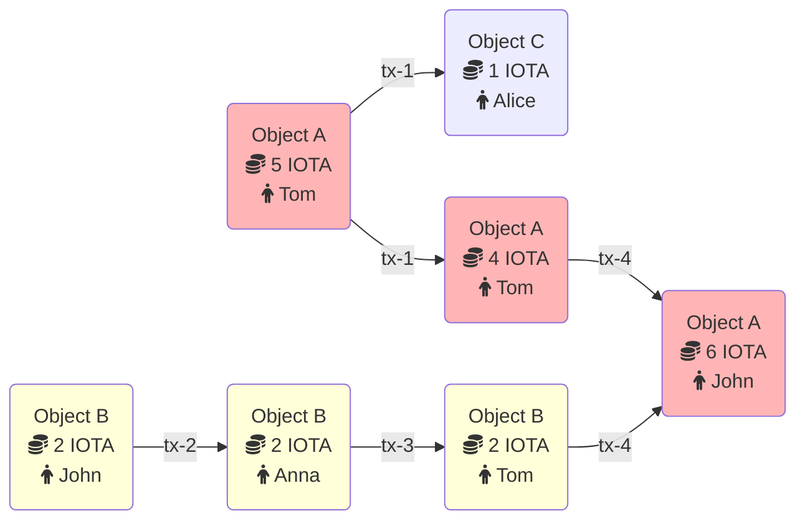

import Quiz from '@site/src/components/Quiz';
import questions from '/json/developer/iota-101/transactions/transactions.json';

# Transactions

Transactions are fundamental to updating the ledger in Move-based blockchains.

## Types of Transactions

In Move, there are two primary types of transactions:

- **User Transactions**: [Programmable transaction blocks](ptb/programmable-transaction-blocks) that any user can submit to the network. They allow you to execute custom logic, interact with smart contracts, and transfer assets.
- **System Transactions**: Exclusive to validators, these transactions are essential for network operations like epoch transitions and checkpointing. They help maintain the blockchain's integrity and performance.

## Key Components of a Transaction

Every transaction in Move includes essential metadata:

- **Sender Address**: The [account address](../../getting-started/get-address.mdx) initiating the transaction.
- **Gas Payment Object**: An object reference used to pay for the transaction's execution and storage costs. This object must be owned by the sender and be of the type `move::coin::Coin<MOVE>`, representing the native currency.
- **Gas Price**: The amount of native tokens per unit of gas the sender is willing to pay. This must be a positive integer.
- **Maximum Gas Budget**: The upper limit of gas units the transaction can consume. Exceeding this budget will abort the transaction, affecting only the gas payment object by deducting the consumed gas.
- **Target Epoch**: The specific epoch for which the transaction is intended.
- **Transaction Type**: Specifies whether it's a call, publish, or native transaction, along with its associated data.
- **Authenticator**: A cryptographic signature and public key pair that verifies the sender's identity.
- **Expiration Epoch**: An optional deadline after which validators will consider the transaction invalid if not yet executed. By default, transactions have no expiration.

## Transaction Workflow Example

To illustrate how transactions interact with objects, consider the following scenario involving IOTA:

### Initial Setup

- **Object A**: Contains 5 IOTA and belongs to Tom.
- **Object B**: Holds 2 IOTA and belongs to John.

### 1: Tom Sends 1 IOTA to Alice

Tom initiates a transaction to send 1 IOTA to Alice using Object A. The transaction results in:

- **Object A**: Now has 4 IOTA and remains with Tom.
- **Object C**: A new object with 1 IOTA belonging to Alice.

### 2: John Sends 2 IOTA to Anna

Simultaneously, John sends his 2 IOTA to Anna. Since this transaction involves different objects, it executes in parallel, transferring ownership of Object B to Anna.

### 3: Anna Sends 2 IOTA to Tom

Anna immediately sends the 2 IOTA to Tom. Tom now possesses:

- **Object A**: 4 IOTA.
- **Object B**: 2 IOTA (ownership transferred to Tom).

### 4: Tom Sends All IOTA to John

Finally, Tom decides to send all his IOTA to John. The transaction consumes both Object A and Object B, combining them into:

- **Object D**: A new object with 6 IOTA belonging to John.
- **Object A** and **Object B**: Consumed and removed from the ledger.

## Transaction and Data Constraints

Move imposes certain limits to ensure network stability and security:

- **Maximum Transaction Size**: Transactions have a byte-size limit to prevent excessive resource consumption.
- **Object Limits**: There's a cap on the number of objects a transaction can read or modify.
- **Data Size Restrictions**: Limits are placed on the size of data payloads within transactions.

You can find detailed limits in the [`protocol-config` module](https://github.com/move-language/move/blob/main/language/move-prover/bytecode/src/protocol_config.rs) of the Move repository, defined in the `ProtocolConfig` struct.

## How Transactions Are Executed

The following diagram outlines the execution flow of a transaction, showing the sequence of function calls across various modules:

<Quiz questions={questions} />
